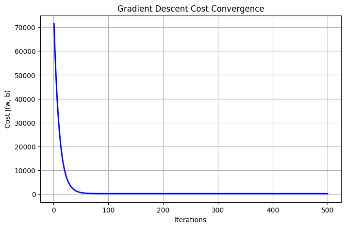

# House Price Regression & Gradient Descent (Python)

## Overview
Regression models for a real-world application (house price prediction) evaluated with MAE, MSE, RMSE and R², plus a from-scratch **Gradient Descent** implementation of Linear Regression whose convergence is analysed and compared with scikit-learn.

## Problem Statement
1. Develop regression models for a real-world application and evaluate their performance using appropriate metrics.
2. Implement and analyse the performance of Gradient Descent optimization for Linear Regression.

## Files
| File | Description |
|---|---|
| `regression_gd.py` / notebook | Source code (add your `.py` or `.ipynb` here) |
| `house_prices_expanded_dataset-v2.csv` | Dataset (add if permitted) |
| `README.md` | This file |
| `sample_input_output.txt` | Sample console output |
| `cost_convergence.png` | Gradient descent cost-vs-iterations plot |

## Dataset
Features: `Area_sqft`, `Bedrooms`, `Bathrooms`, `Age_years`. Target: `Price_1000s`. 80/20 train-test split (`random_state=42`).

## How It Works
- **Simple Linear Regression:** uses `Area_sqft` only (scikit-learn).
- **Multiple Linear Regression:** uses all four features (scikit-learn).
- **Gradient Descent (custom):** features standardised with `StandardScaler`; weights and bias start at 0; 500 iterations, learning rate 0.05; cost J = (1/2m)Σ(ŷ−y)²; parameters updated using gradients `dw` and `db`.

## Requirements
Python 3, `numpy`, `pandas`, `matplotlib`, `scikit-learn` (`pip install numpy pandas matplotlib scikit-learn`)

## How to Run
Place the CSV in the same folder, then run the script or the notebook cells in order. The convergence plot is saved as `cost_convergence.png`.

## Results
| Model | MAE | MSE | RMSE | R² |
|---|---|---|---|---|
| Simple Linear Regression | 30.20 | 1367.58 | 36.98 | 0.9085 |
| Multiple Linear Regression | 12.70 | 219.39 | 14.81 | 0.9853 |
| Gradient Descent | 12.70 | 219.39 | 14.81 | 0.9853 |

## Key Observations
- Using all four features cuts RMSE from 36.98 to 14.81 and raises R² from 0.9085 to 0.9853.
- Gradient descent converges smoothly (cost ≈ 71,000 initially, flat after ~100 iterations) and matches scikit-learn's metrics.
- Feature scaling is essential for fast, stable convergence.

## Author
Ritesh Gavhane 202401100082
